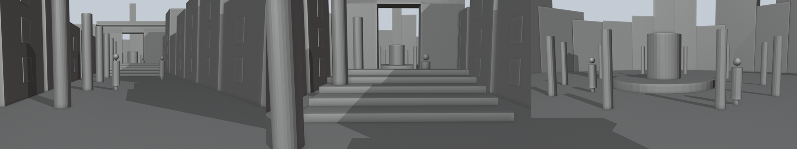
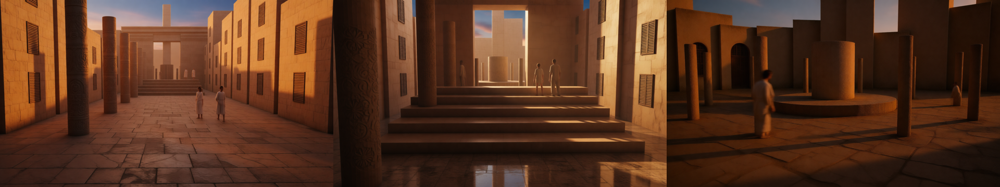

# 白膜（3D 灰模）出片实测（2026-10-07）

本文只记录方法、结论和成本，不含密钥、客户素材或成片。

## 1. 结论先行

- 白膜解决的是**空间与镜头**问题，不是“换人”问题。换人复刻的结构参考就是原片，不需要白膜。
- 适合：原创的空间感镜头（产品展示、空间/建筑、需要精确运镜的大片感、多镜头保持同一场景）。
- 本方案用的接口（wan2.2-i2v-flash）**只吃首帧图 + 文字**，不接受白膜视频当控制信号：白膜锁住的是“首帧的空间结构”，运镜靠提示词，只是近似。
- 真正“逐帧锁运镜”需要带控制视频输入的模型（如本地 Wan VACE / Fun-Control），本机 8 GB 显存只能跑 1.3B 小模型，画质不如云端，**本次未做**。

## 2. 流程

| 步骤 | 工具 | 说明 |
| --- | --- | --- |
| 白膜首帧 | Blender 5.x 无界面 + Python（Workbench 渲染） | 本地免费，3 个机位约 3 秒；不需要 Blender MCP |
| 首帧写实化 | qwen-image-edit-plus | 保持构图与几何，改材质/光影；模型会自行把胶囊小人换成真人 |
| 图生视频 | wan2.2-i2v-flash（基于首帧，无声，固定 5 秒） | 先 480P 试，通过后 720P 出片 |
| 拼接 | ffmpeg xfade | 0.5 秒交叉淡化 |

## 3. 实测

- **直接用灰模首帧生成视频**：空间结构全程稳定（圆柱/台阶/拱门不漂不变形），但**画面仍是灰模**——图生视频忠实延续首帧外观，文字提示改不动风格。所以必须先写实化首帧。
- **写实化首帧后生成**：三个镜头的结构稳定、光影有层次、行人走动自然，色调统一；14 秒成片可看。
- 白膜里的胶囊小人会被当成“石墩”，**不要放胶囊小人**，留空让模型生成行人更自然。
- 拱门别用实心圆柱当拱顶（会堵死门洞）；地面铺大一点，避免首帧边缘穿帮。

## 4. 成本（北京区官方原价，以控制台折扣为准）

| 项目 | 单价 | 备注 |
| --- | --- | --- |
| wan2.2-i2v-flash 480P | ¥0.10/秒 | 5 秒 ¥0.5 |
| wan2.2-i2v-flash 720P | ¥0.20/秒 | 5 秒 ¥1.0 |
| qwen-image-edit-plus | ¥0.2/张 | |
| qwen-image-edit | ¥0.3/张 | |

本次 3 镜头 14 秒成片总花费约 ¥4.3（含一次灰模测试 ¥0.5、4 次首帧写实化 ¥0.8、3 个 720P 镜头 ¥3.0）。被拒绝的请求不计费。

## 5. 踩坑（API）

- 首帧模型的路径是 `/api/v1/services/aigc/video-generation/video-synthesis`；`image2video/video-synthesis` 是首尾帧模型用的，用错会返回 `url error`（不计费）。
- 首帧 `img_url` 可直接传 `data:image/png;base64,…`，宽高需在 240–8000 像素之间。
- 输出分辨率 720P 实际为 1280×704。

## 6. 已知局限

- 无声视频，配乐/音效要另配。
- 镜头之间只靠淡化衔接：各镜首帧是独立机位，不是上一镜末帧，空间上有轻微跳变。
- 运镜只是近似白膜（见第 1 节）。

## 7. 复现

见 `workflows/whitemodel-scene/README.md`。
